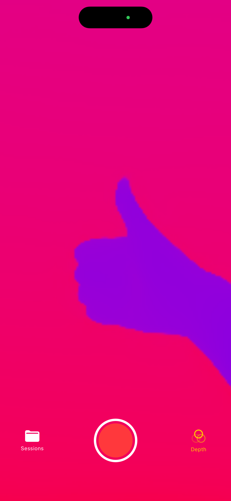

# Philo Homes — iOS 3D Sensor Logger

An iOS app for capturing synchronized multi-sensor data for 3D scene reconstruction pipelines. Records RGB frames, camera intrinsics/extrinsics, IMU, and LiDAR depth (where available) with all data timestamped on a common clock.

---

## Requirements

| | |
|---|---|
| **Xcode** | 16.2+ |
| **iOS Deployment Target** | 16.0+ |
| **Device** | Any ARKit-capable iPhone or iPad (A9 chip or later) |
| **LiDAR depth** | iPhone 12 Pro / 13 Pro / 14 Pro / 15 Pro / 16 Pro, iPad Pro 2020+ |

The app runs on any ARKit device. LiDAR depth capture is automatically enabled if the device supports it and skipped otherwise.

---

## Features

### Recording
- Full-screen live camera preview via ARKit
- One-tap record/stop button (camera-style UI)
- All sensor streams captured per-frame and written asynchronously to disk

### Sensor Data
| Stream | Format | Notes |
|--------|--------|-------|
| RGB frames | JPEG (quality 0.9) | One file per frame |
| Camera extrinsics | 4×4 column-major float matrix | Camera-to-world transform |
| Camera intrinsics | 3×3 column-major float matrix | fx, fy, cx, cy |
| IMU | Embedded in `frames.jsonl` | Sampled per-frame, same clock as ARKit |
| LiDAR depth | Raw `Float32` binary | One file per frame, 256×192 typical |
| Depth confidence | Raw `UInt8` binary | 0=low, 1=medium, 2=high |

All data is synchronized to ARKit's `ARFrame.timestamp` (Mach absolute time). IMU uses the same clock (`CMDeviceMotion.timestamp`), so the offset between camera and IMU is directly computable.

### Depth Camera View
The depth button (bottom-right) toggles a live false-color depth overlay (blue = near, red = far). On devices without LiDAR the button is grayed out and shows an explanatory alert on tap.

### Session Browser
- Lists all past recordings with frame count, size, and depth indicator
- Export via iOS share sheet (`metadata.json` + `frames.jsonl`)
- Swipe to delete sessions

---

## Screenshots

| Camera view | Depth overlay |
|:-----------:|:-------------:|
|  |  |

---

## Output Structure

Each recording is saved to the app's Documents directory (accessible via Files app or Finder):

```
Documents/session_YYYYMMDD_HHmmss/
├── metadata.json         # Session summary
├── frames.jsonl          # Per-frame sensor data (one JSON object per line)
├── rgb/
│   ├── 000000.jpg
│   ├── 000001.jpg
│   └── ...
├── depth/                # LiDAR devices only
│   ├── 000000.bin        # Float32, row-major
│   └── ...
└── confidence/           # LiDAR devices only
    ├── 000000.bin        # UInt8, row-major
    └── ...
```

### metadata.json
```json
{
  "sessionID": "session_20260331_142301",
  "deviceModel": "iPhone15,2",
  "osVersion": "16.6.1",
  "startTimestamp": 12300.0,
  "endTimestamp": 12360.0,
  "frameCount": 1800,
  "hasDepth": false,
  "rgbResolution": [1920, 1440],
  "depthResolution": null
}
```

### frames.jsonl
One JSON object per line. See [`docs/frames_jsonl_format.md`](docs/frames_jsonl_format.md) for full field reference and Python loading examples. Key fields:

```
frame_index, timestamp
camera_transform[16]     — 4×4 column-major camera-to-world
camera_intrinsics[9]     — 3×3 column-major K matrix
camera_resolution[2]     — [width, height]
camera_euler_angles[3]   — pitch, yaw, roll (radians)
tracking_state           — normal | limited_* | not_available
exposure_duration, exposure_offset
has_depth, depth_resolution[2]
feature_point_count
ambient_intensity, ambient_color_temperature
imu_timestamp
user_acceleration[3]     — linear accel minus gravity (g)
rotation_rate[3]         — gyroscope (rad/s)
gravity[3]               — gravity vector (g)
attitude_euler[3]        — roll, pitch, yaw (radians)
attitude_quaternion[4]   — x, y, z, w
magnetic_field[3]        — calibrated (µT)
```

---

## Loading Data in Python

```python
import numpy as np
import json
from pathlib import Path

session = Path("session_20260331_142301")

# Load all frames
frames = [json.loads(l) for l in (session / "frames.jsonl").read_text().splitlines()]

# Camera pose for frame 0
T = np.array(frames[0]["camera_transform"]).reshape(4, 4, order='F')
position = T[:3, 3]
rotation = T[:3, :3]

# Intrinsics
K = np.array(frames[0]["camera_intrinsics"]).reshape(3, 3, order='F')
fx, fy, cx, cy = K[0,0], K[1,1], K[0,2], K[1,2]

# Depth map (LiDAR only)
w, h = frames[0]["depth_resolution"]
depth = np.fromfile(session / "depth/000000.bin", dtype=np.float32).reshape(h, w)
conf  = np.fromfile(session / "confidence/000000.bin", dtype=np.uint8).reshape(h, w)
```

---

## Retrieving Recordings

**On-device:** Files app → On My iPhone → Philo Homes

**Via Mac:** Finder → select iPhone → Files → Philo Homes

**Export:** Open the Sessions tab in the app, tap the share icon on any session to send `metadata.json` and `frames.jsonl` via AirDrop, Files, or any other share target. RGB and depth binary files can be retrieved directly through Finder or the Files app.

---

## Project Structure

```
iOS-3D-Logger/
├── iOS-3D-Logger.xcodeproj/
├── iOS-3D-Logger/
│   ├── iOS_3D_LoggerApp.swift       # App entry point
│   ├── ContentView.swift            # Camera UI, depth toggle, record button
│   ├── SessionBrowserView.swift     # Session list and export
│   ├── Services/
│   │   ├── ARSessionManager.swift   # ARKit session, per-frame data extraction
│   │   ├── FrameFilter.swift        # fps / motion / sharpness frame gating
│   │   ├── IMURecorder.swift        # CoreMotion device motion (per-frame sampling)
│   │   └── DataWriter.swift         # Async disk I/O
│   ├── Models/
│   │   └── RecordingSession.swift   # Session metadata model
│   └── Assets.xcassets/
└── docs/
    ├── frames_jsonl_format.md       # Full output format reference
    └── assets/                      # Screenshots
```

---

## Intended Use

Output data is designed to feed directly into:
- **Photogrammetry / MVS pipelines** (COLMAP, OpenMVS) using RGB + intrinsics + poses
- **Neural radiance field** methods (NeRF, Gaussian Splatting) using posed images
- **Visual-inertial odometry** research using the synchronized IMU stream
- **Depth fusion** pipelines using LiDAR depth + confidence + RGB + poses
